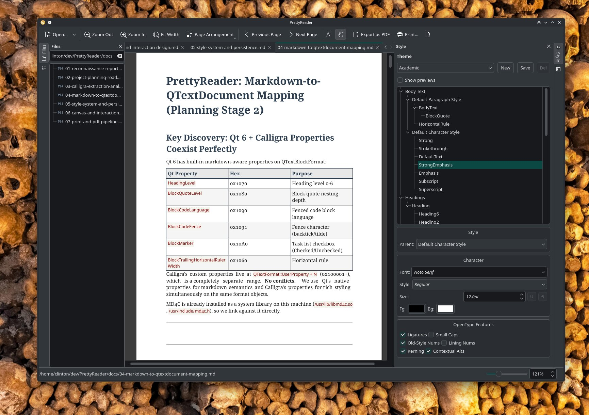

# PrettyReader



A markdown viewer for KDE.

It shows your markdown files with nice formatting, pagination, and page margins. You can scroll through the pages or view them one at a time.

It also does syntax highlighting for code blocks. And headings, bold, italic, strikethrough, links, block quotes, lists, task lists, tables, horizontal rules, and images. It uses MD4C for parsing.

It also has a table of contents sidebar that generates automatically from your headings. And a file browser dock so you can open files without leaving the application. Both sidebars are collapsible.

It also has a style system. You can configure fonts, colors, spacing, and alignment for every element type individually. Headings, body text, code blocks, block quotes, tables, list items. Each one has its own paragraph style and character style with full property sheets. The style dock has a tree view.

It also has themes. Themes are JSON files. There are two built-in ones and you can create your own. They persist to your XDG config directory.

It also has configurable page sizes. A4, Letter, Legal, and so on, portrait or landscape, with per-side margin controls.

It also has master pages. You can set different headers, footers, and margins for the first page versus odd pages versus even pages, independently.

It also has headers and footers. They support field codes like `{page}`, `{pages}`, `{filename}`, `{title}`, `{date}`, and `{time}`, including custom date format strings. Each one has its own font and color settings, and optional separator lines.

It also has footnotes. It parses PHP Markdown Extra footnote syntax, renders them at the bottom of pages with a separator rule, and supports configurable numbering in Arabic, Roman numeral, alphabetic, or asterisk styles, with optional superscript, and can restart numbering per-page or per-document.

It also does hyphenation. It ships bundled libhyphen dictionaries for US and British English and inserts soft hyphens at line break opportunities with configurable minimum word length.

It also has its own layout engine. It does not use QTextDocument for final output. It converts the parsed markdown into a semantic content model, shapes the text with HarfBuzz, finds line break opportunities with ICU, and produces a box tree of glyph runs, line boxes, block boxes, table boxes, and footnote section boxes, then paginates them.

It also has its own PDF writer. It embeds subsetted fonts via HarfBuzz-subset, draws the box tree with precise glyph positioning, and produces a self-contained PDF with clickable links and document metadata. It renders the pages back through Poppler for the WYSIWYG preview.

It also has an async render cache. PDF pages are rasterized in a background thread with LRU memory eviction and a generation counter to prevent stale frames from a previous document leaking into the current view.

It also has a text selection tool. You can switch between a hand tool for panning and a selection tool for highlighting text across pages. Double-click selects a word. Drag selects by source-map regions for clean, line-snapped highlighting.

It also copies to the clipboard in four formats. Plain text, Markdown, styled RTF, and configurable RTF with a dialog that lets you choose which style properties to include in the output.

It also has syntax highlighting theme selection for code blocks, separate from the document theme. There are 31 KSyntaxHighlighting themes to choose from. Breeze, Monokai, Dracula, Solarized, GitHub, Nord, Catppuccin, and so on.

It also lets you right-click on any code block to manually assign a syntax language via a searchable dialog with 300+ languages organized by section. The override persists per-file.

It also has six view modes. Continuous, single page, facing pages, facing pages with the first page alone, continuous facing, and continuous facing with the first page alone.

It also has middle-mouse-button smooth zoom. You hold the middle button and drag up to zoom in or down to zoom out, centered on the click point, like Okular.

It also has table page-breaking. If a table is too tall for the remaining page, it splits across pages and repeats the header rows on each continuation.

It also watches the file on disk and auto-reloads when it changes, with a 300ms debounce and scroll position preservation.

It also has per-file metadata persistence. Your zoom level, scroll position, theme override, image size overrides, and code block language overrides are saved per file via content-hashed JSON in your local data directory and expire after a configurable number of days.

It also has tabs. You can open multiple files at once.

It also has a configurable table style system with separate properties for header cells, body cells, outer borders, inner grid lines, header separator weight, cell padding, and per-cell background colors and alignment.

It also has link hover detection. When you mouse over a hyperlink it shows the URL in the status bar.

It also has a preferences dialog.

It also exports to PDF.

And it prints.

## Building

```
cmake -B build
cmake --build build
```

### Dependencies

Qt 6.6+, KDE Frameworks 6, Poppler (Qt6), FreeType, HarfBuzz (with ICU and subset modules), ICU, fontconfig, libhyphen, md4c, zlib.

On Arch/Manjaro:

```
pacman -S qt6-base extra-cmake-modules ki18n kcoreaddons kxmlgui kiconthemes \
  kconfigwidgets kconfig kio syntax-highlighting poppler-qt6 freetype2 \
  harfbuzz harfbuzz-icu icu fontconfig hyphen md4c zlib
```

## License

GPLv3. See [COPYING](COPYING).
